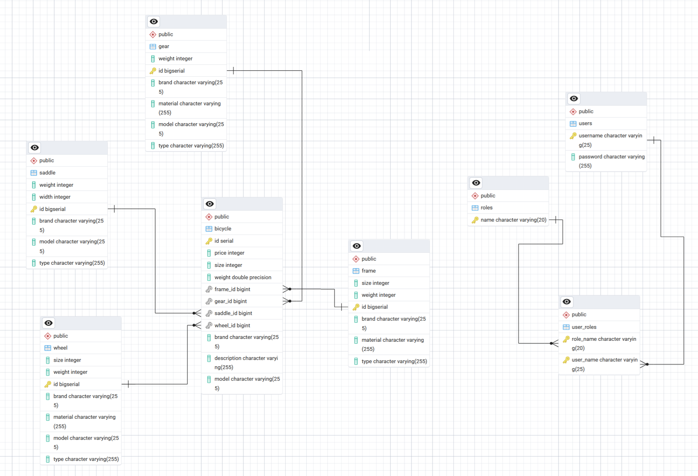

This is a simple basic REST API used as a template for the exam.
It is implemented using Javalin and JPA

### How to run

1. Create a database in your local Postgres instance called garden
2. Run the main method in the Main class to start the server on port 7070, to create the tables in the database and to
   populate the database with some test data(happens in the ApplicationConfig class)
3. See the routes in your browser at `http://localhost:7070/routes`
4. Request the `http://localhost:7070/resellers` endpoint in your browser to see the list of Resellers and Plants
5. Use the garden.http file to test the routes, GET/POST/PUT/DELETE requests are available

### How to test

5.4 Forskelle mellem enhedstest og integrationstest

Enhedstest handler om at teste små dele af koden, ofte enkeltstående metoder i klasser, for at sikre, at de fungerer,
som de skal. Disse tests køres i isolation, hvilket betyder, at de ikke afhænger af databaser eller
netværksforbindelser. Derfor er enhedstest hurtigere, fordi de kan køres uden at applikationen behøver at være i drift.
I enhedstest bruger vi ofte mocks og stubs til at simulere de dele af koden, som vi ikke tester.

Integrationstest tester derimod, hvordan flere dele af systemet arbejder sammen. I denne opgave fokuserer vi på, hvordan
PlantCenterDAO interagerer med databasen, for at sikre at CRUD-operationer (oprette, læse, opdatere og slette) fungerer
korrekt i en virkelighedsnær situation. Disse tests kræver oprettelse og sletning af testdata i databasen, hvilket gør
dem langsommere end enhedstest, men de giver et mere præcist billede af, hvordan systemet vil opføre sig i praksis.

6.5 Forskelle mellem test af REST-endpoints og enhedstest

Når vi tester REST-endpoints, handler det om at tjekke, hvordan API'et reagerer på forskellige HTTP-anmodninger. Dette
inkluderer at teste metoder som GET, POST, PUT og DELETE for at sikre, at serveren giver de rigtige svar og dataformater.
Under disse tests arbejder vi med en aktiv server, som f.eks. en Javalin-server, og vi har ofte brug for en testdatabase.

Forskellen på enhedstest er, at REST-endpoint tests ser på hele systemet fra anmodningen til svaret fra serveren.
De tester netværkskommunikation, hvordan data sendes og modtages, samt interaktionen med databasen. Det gør disse tests
mere omfattende og derfor også langsommere og mere komplekse end enhedstest. Men de er vigtige for at sikre, at API'et
fungerer korrekt i en situation, der minder om det virkelige liv.

ER-Diagram:

